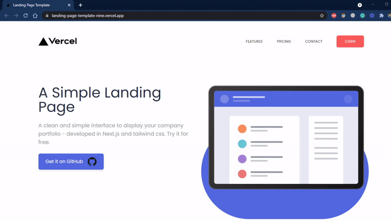

<div align="center">

# Company's Landing Page Template

<strong>
A clean and simple interface to display your company portfolio - developed in Next.js and tailwind css. Try it for free.
</strong>
</div>

<br>

<div align="center">
	
	
</div>

## 🏗 How to use

1. `Fork` the repo or click on the `Use this template` button to create a personal repository with this template.
2. Install the dependencies with npm or yarn package manager.

```bash
yarn
# or
npm install
```

2. Run the development server with the follwing commands in your terminal.

```bash
yarn run dev
# or
npm run dev
```

3. Create a production build, ready to deploy.

```bash
yarn run build
# or
npm run build
```

## ⏯ Preview



## Deploy your own landing page

Deploy it to the cloud with [Vercel](https://vercel.com/new?utm_source=github&utm_medium=readme&utm_campaign=next-example) ([Documentation](https://nextjs.org/docs/deployment)).

## 👨🏻‍💻 Contributing

Make sure you read the [contributing guidelines](contributing.md) before opening a PR.

## 🔑 License & Conduct

- MIT © [Ehmad Saeed](https://github.com/justEhmadSaeed)
- [Code of Conduct](CODE_OF_CONDUCT.md)
- Design Inspiration: John Komarnicki
